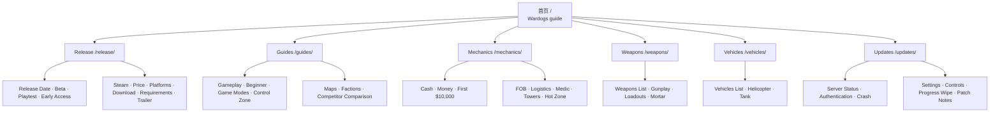

# WARDOGS 页面矩阵及站点结构

> 基准文件：`keywords.json`  
> 规划日期：2026-08-23  
> 用途：作为第一版网站内容架构、URL 规划、页面生产顺序和内部链接的执行参考。

## 一、规划结论

第一版网站采用“1 个首页 + 6 个导航页 + 39 个关键词内页”的结构，共承接 `keywords.json` 中的 40 个主关键词。

- 首页承接 `Wardogs guide`，回答“这是什么游戏、现在能不能玩、第一次应该先看什么”。
- 6 个导航页只做主题聚合、内容发现和权重分发，不与关键词内页争夺同一个主词。
- 其余 39 个关键词分别对应唯一内页，遵守“一个搜索意图一个权威页面”。
- 发布前先做访问、发布日期、价格和玩法基础页；发布周优先做服务器、登录、崩溃、设置和新手问题；获得稳定实测数据后再扩展武器、载具和角色攻略。

## 二、搜索需求分类

### 1. 通用需求

通用需求是玩家面对大多数新游戏都会搜索的问题，流量通常更大、出现更早，但竞争也更直接。

| 需求阶段 | 用户正在问什么 | 对应关键词 |
|---|---|---|
| 了解游戏 | 这是什么游戏、怎么玩、是否像 Battlefield | Wardogs guide、Wardogs gameplay、Wardogs vs Battlefield Squad and Arma |
| 获取资格 | 测试是否开放、如何申请、是否收到邀请 | Wardogs beta、Wardogs playtest、Wardogs early access |
| 决定购买 | 何时发布、多少钱、是否免费、支持哪些平台 | Wardogs release date、Wardogs price、Wardogs Steam、Wardogs PS5 and Xbox |
| 安装运行 | 怎么下载、能不能预载、电脑能不能运行 | Wardogs download and preload、Wardogs system requirements |
| 学习操作 | 第一次怎么玩、按键怎么设置、如何提高帧数 | Wardogs beginner guide、Wardogs controls and keybinds、Wardogs best settings |
| 解决故障 | 服务器是否宕机、登录失败、崩溃如何处理 | Wardogs server status、Wardogs failed to authenticate、Wardogs crash fix |
| 跟踪变化 | 最新版本改了什么、数据会不会清空 | Wardogs patch notes、Wardogs progress wipe |
| 观看素材 | 官方预告片在哪里、不同视频属于哪个版本 | Wardogs trailer |

### 2. 个性需求

个性需求来自 WARDOGS 独有或特别重要的玩法系统。搜索量可能在发布前较小，但更能建立主题权威和网站差异化。

| WARDOGS 特征 | 用户正在问什么 | 对应关键词 |
|---|---|---|
| 三队 Control Zone | 主模式是什么、如何计分、如何赢 | Wardogs game modes、Wardogs Control Zone guide |
| 地图与阵营 | 地图多大、目标在哪里、三个阵营有何区别 | Wardogs maps guide、Wardogs factions |
| 持续现金经济 | 钱是否跨局保留、怎样赚钱、第一笔钱怎么买 | Wardogs cash economy、Wardogs how to make money、Wardogs first 10000 loadout |
| 建造与后勤 | FOB 怎么建、怎么补给、支援行为如何帮助团队 | Wardogs FOB guide、Wardogs logistics guide |
| 角色自由组合 | Medic 如何救人、不同任务怎样配装 | Wardogs medic and revive guide、Wardogs loadouts |
| 动态目标 | 塔怎么占、终端或代码如何操作、Hot Zone 有什么收益 | Wardogs towers guide、Wardogs Hot Zone guide |
| 枪械系统 | 有哪些武器、弹道与手感如何、迫击炮怎么用 | Wardogs weapons list、Wardogs gunplay、Wardogs mortar guide |
| 联合作战载具 | 有哪些载具、直升机怎么飞、坦克怎样使用 | Wardogs vehicles list、Wardogs helicopter guide、Wardogs tank guide |

## 三、首页、导航页和内页分工

### 首页

首页 URL 为 `/`，主关键词为 `Wardogs guide`。

首页不是 40 篇文章的简单列表，而是玩家的决策入口，首屏依次回答：

1. WARDOGS 是什么游戏。
2. 当前发布日期、Beta、Playtest 和 Early Access 状态。
3. 第一次进入游戏应该读哪几篇内容。
4. 当前是否存在服务器或登录问题。
5. 最值得进入的机制、武器和载具内容集群。

首页必须突出以下入口：Release Date、Beta、Playtest、Gameplay、Beginner Guide、Server Status、Cash Economy、Weapons List 和 Vehicles List。

### 导航页

导航页承担聚合与内链，不独占 `keywords.json` 中的主关键词。

| 导航页 | URL | 聚合内容 | 首页导航名称 |
|---|---|---|---|
| Release & Access | `/release/` | 发布、测试、商店、平台、下载、媒体 | Release |
| Guides | `/guides/` | 玩法、新手、模式、地图、阵营和对比 | Guides |
| Mechanics | `/mechanics/` | 经济、角色、目标、FOB、后勤 | Mechanics |
| Weapons | `/weapons/` | 武器目录、枪战机制、配装、迫击炮 | Weapons |
| Vehicles | `/vehicles/` | 载具目录、直升机、坦克 | Vehicles |
| Updates & Fixes | `/updates/` | 服务器、错误、性能、按键、更新 | Updates |

### 内页

每个内页只解决一个明确问题。页面可以覆盖同义词和相关问法，但不能再为同义词建立第二个页面。例如 `Wardogs open beta`、`Wardogs closed beta` 和 `Wardogs beta date` 都由 `Wardogs beta` 页面承接。

## 四、第一版页面矩阵

优先级说明：

- `P0-A`：Early Access 前必须完成。
- `P0-B`：发布周必须完成并高频更新。
- `P1`：第一轮主题扩展，官方资料足够即可发布。
- `P2`：依赖稳定实测数据，禁止用猜测填充。

### A. 首页

| 页面 | URL | 主关键词 | 需求类型 | 解决的具体问题 | 优先级 |
|---|---|---|---|---|---|
| WARDOGS Guide 首页 | `/` | Wardogs guide | 通用 | 我第一次了解 WARDOGS，应先知道哪些事实、当前能否游玩、从哪里开始？ | P0-A |

### B. Release & Access

| 页面 | URL | 主关键词 | 需求类型 | 解决的具体问题 | 优先级 |
|---|---|---|---|---|---|
| Release Date | `/release/release-date/` | Wardogs release date | 通用 | WARDOGS 具体哪天发布，Early Access 与正式版日期是否相同，时间是否可能变化？ | P0-A |
| Beta Status | `/release/beta/` | Wardogs beta | 通用 | Beta 是否正在进行、何时开始和结束、Closed Beta 与后续测试有什么区别？ | P0-A |
| Playtest Access | `/release/playtest/` | Wardogs playtest | 通用 | 在哪里申请 Playtest、申请是否保证资格、邀请和 Steam 库入口在哪里？ | P0-A |
| Early Access | `/release/early-access/` | Wardogs early access | 通用 | Early Access 包含什么、预计持续多久、与完整版本有什么差别？ | P0-A |
| Steam Guide | `/release/steam/` | Wardogs Steam | 通用 | 哪个是官方 Steam 页面、如何购买或申请测试、支持哪些语言和功能？ | P0-A |
| Price and Editions | `/release/price/` | Wardogs price | 通用 | 游戏多少钱、是否免费、有哪些版本、预购和 Supporter Edition 有什么区别？ | P0-A |
| PS5 and Xbox Status | `/release/platforms/` | Wardogs PS5 and Xbox | 通用 | 是否有 PS5 或 Xbox 版本，当前确认平台是什么，主机版有没有日期？ | P0-A |
| Download and Preload | `/release/download-preload/` | Wardogs download and preload | 通用 | 如何安全下载、测试客户端在哪里、是否能预载、需要多少空间？ | P0-B |
| System Requirements | `/release/system-requirements/` | Wardogs system requirements | 通用 | 我的电脑能不能运行，最低与推荐配置分别对应什么体验？ | P0-A |
| Trailer Archive | `/release/trailer/` | Wardogs trailer | 通用 | 哪些是官方预告片和玩法视频，每段素材来自哪个版本，能证明什么？ | P1 |

### C. Guides

| 页面 | URL | 主关键词 | 需求类型 | 解决的具体问题 | 优先级 |
|---|---|---|---|---|---|
| Gameplay Explained | `/guides/gameplay/` | Wardogs gameplay | 通用 | 一局 WARDOGS 的完整循环是什么，玩家如何进入目标、赚钱、购买和重生？ | P0-A |
| Beginner Guide | `/guides/beginner-guide/` | Wardogs beginner guide | 通用 | 第一局应该做什么、先买什么、跟随哪个目标、哪些错误最容易浪费现金？ | P0-B |
| WARDOGS Comparison | `/guides/wardogs-vs-battlefield-squad-arma/` | Wardogs vs Battlefield Squad and Arma | 个性 | 它与 Battlefield、Squad、Arma 在人数、节奏、经济、建造和拟真程度上有什么不同？ | P1 |
| Game Modes | `/guides/game-modes/` | Wardogs game modes | 个性 | 当前有哪些模式，核心模式是否只有 Control Zone，比赛如何开始和结束？ | P1 |
| Control Zone Guide | `/guides/control-zone/` | Wardogs Control Zone guide | 个性 | Control Zone 如何生成、如何计分、达到多少分获胜、三队如何争夺？ | P0-B |
| Maps Guide | `/guides/maps/` | Wardogs maps guide | 个性 | 地图有多大、Control Zone 在哪里出现、路线和地形如何影响比赛？ | P1 |
| Factions Guide | `/guides/factions/` | Wardogs factions | 个性 | 三个阵营叫什么、是否有独特装备或加成、目前哪些差异仍未确认？ | P1 |

### D. Mechanics

| 页面 | URL | 主关键词 | 需求类型 | 解决的具体问题 | 优先级 |
|---|---|---|---|---|---|
| Cash Economy | `/mechanics/cash-economy/` | Wardogs cash economy | 个性 | 现金是否跨对局保留、死亡会损失什么、应该保留多少重生预算？ | P0-B |
| How to Make Money | `/mechanics/how-to-make-money/` | Wardogs how to make money | 个性 | 击杀、救援、运输、补给和占点分别怎样赚钱，哪些方式适合新手？ | P0-B |
| First 10000 Loadout | `/mechanics/first-10000-loadout/` | Wardogs first 10000 loadout | 个性 | 初始 10,000 美元应该怎么买第一套装备，怎样避免第一局破产？ | P0-B |
| FOB Guide | `/mechanics/fob-guide/` | Wardogs FOB guide | 个性 | FOB 应建在哪里、需要哪些物资、如何补给、防守和拆除？ | P1 |
| Logistics Guide | `/mechanics/logistics/` | Wardogs logistics guide | 个性 | 如何运输玩家和物资、怎样规划补给路线、后勤行为是否奖励现金？ | P1 |
| Medic and Revive | `/mechanics/medic-revive/` | Wardogs medic and revive guide | 个性 | 怎样安全救人、Medic 应携带什么、救援如何影响团队和个人收益？ | P1 |
| Towers Guide | `/mechanics/towers/` | Wardogs towers guide | 个性 | 塔和终端如何占领、需要输入什么、所谓 tower code 实际指什么操作？ | P0-B |
| Hot Zone Guide | `/mechanics/hot-zone/` | Wardogs Hot Zone guide | 个性 | Hot Zone 如何出现、奖励是否翻倍、什么时候值得离开主目标去争夺？ | P1 |

### E. Weapons

| 页面 | URL | 主关键词 | 需求类型 | 解决的具体问题 | 优先级 |
|---|---|---|---|---|---|
| Weapons List | `/weapons/weapons-list/` | Wardogs weapons list | 个性 | 当前版本有哪些已确认武器，它们属于什么类型、弹药和角色路线？ | P1 |
| Gunplay Guide | `/weapons/gunplay/` | Wardogs gunplay | 个性 | 枪械是否使用弹道、后坐力和重量如何影响手感，瞄准与压枪怎么练？ | P1 |
| Loadouts | `/weapons/loadouts/` | Wardogs loadouts | 个性 | 不同预算、角色和任务应该如何组合武器、装备与工具？ | P2 |
| Mortar Guide | `/weapons/mortar-guide/` | Wardogs mortar guide | 个性 | 迫击炮如何部署、瞄准和校射，如何配合观察员并避免误伤或浪费弹药？ | P2 |

### F. Vehicles

| 页面 | URL | 主关键词 | 需求类型 | 解决的具体问题 | 优先级 |
|---|---|---|---|---|---|
| Vehicles List | `/vehicles/vehicles-list/` | Wardogs vehicles list | 个性 | 当前版本有哪些载具，各自负责战斗、运输还是后勤，价格和乘员需求是什么？ | P1 |
| Helicopter Guide | `/vehicles/helicopter-guide/` | Wardogs helicopter guide | 个性 | 直升机如何起飞、悬停、降落和运输，哪些设置适合新飞行员？ | P2 |
| Tank Guide | `/vehicles/tank-guide/` | Wardogs tank guide | 个性 | 坦克和火炮载具如何操作、需要几名乘员、怎样选路线和应对反载具威胁？ | P2 |

### G. Updates & Fixes

| 页面 | URL | 主关键词 | 需求类型 | 解决的具体问题 | 优先级 |
|---|---|---|---|---|---|
| Server Status | `/updates/server-status/` | Wardogs server status | 通用 | 服务器现在是否在线、故障从何时开始、官方是否确认、下一次更新时间是什么？ | P0-B |
| Authentication Fix | `/updates/failed-to-authenticate/` | Wardogs failed to authenticate | 通用 | Failed to Authenticate 是服务器、资格还是本地客户端问题，安全排查顺序是什么？ | P0-B |
| Crash Fix | `/updates/crash-fix/` | Wardogs crash fix | 通用 | 启动崩溃、重启、卡顿或缺少可执行文件时，应该按什么顺序检查？ | P0-B |
| Best Settings | `/updates/best-settings/` | Wardogs best settings | 通用 | 怎样获得稳定帧率并保持战场可见度，哪些设置最影响 CPU、GPU 和延迟？ | P0-B |
| Controls and Keybinds | `/updates/controls-keybinds/` | Wardogs controls and keybinds | 通用 | 键鼠和手柄按键是什么、是否支持手柄和辅助瞄准、怎样修改键位？ | P0-B |
| Progress Wipe | `/updates/progress-wipe/` | Wardogs progress wipe | 通用 | Beta 或赛季结束后现金、XP、装备和账号进度是否清空？ | P0-B |
| Patch Notes | `/updates/patch-notes/` | Wardogs patch notes | 通用 | 最新补丁改了什么、哪些数值或问题受到影响、旧攻略是否仍然适用？ | P0-B |

## 五、第一批实际上线顺序

### 第 1 批：发布前基础盘（P0-A，共 11 页）

1. 首页：Wardogs guide
2. Wardogs release date
3. Wardogs beta
4. Wardogs playtest
5. Wardogs early access
6. Wardogs Steam
7. Wardogs price
8. Wardogs PS5 and Xbox
9. Wardogs system requirements
10. Wardogs gameplay
11. Wardogs server status

这批页面先建立实体、访问、购买和核心玩法基础。Server Status 虽属于发布周需求，但应提前建立可更新 URL，避免故障发生后临时创建。

### 第 2 批：发布周需求（P0-B，共 13 页）

1. Wardogs download and preload
2. Wardogs beginner guide
3. Wardogs Control Zone guide
4. Wardogs cash economy
5. Wardogs how to make money
6. Wardogs first 10000 loadout
7. Wardogs towers guide
8. Wardogs failed to authenticate
9. Wardogs crash fix
10. Wardogs best settings
11. Wardogs controls and keybinds
12. Wardogs progress wipe
13. Wardogs patch notes

### 第 3 批：主题权威扩展（P1，共 11 页）

1. Wardogs trailer
2. Wardogs vs Battlefield Squad and Arma
3. Wardogs game modes
4. Wardogs maps guide
5. Wardogs factions
6. Wardogs FOB guide
7. Wardogs logistics guide
8. Wardogs medic and revive guide
9. Wardogs Hot Zone guide
10. Wardogs weapons list
11. Wardogs vehicles list

### 第 4 批：实测数据页（P2，共 5 页）

1. Wardogs gunplay
2. Wardogs loadouts
3. Wardogs mortar guide
4. Wardogs helicopter guide
5. Wardogs tank guide

P2 页面必须有稳定版本数据、截图或可复现操作后再发布。`Progress Wipe` 虽然属于发布周高时效词，但如果官方尚未给出答案，只能先作为相关页面 FAQ，不应发布空洞独立页。

## 六、简单站点结构

## 七、内部链接规则

### 首页到导航页

首页固定链接到全部 6 个导航页，并在首屏或首屏之后直接链接当前最高优先级页面。首页不应只链接“查看更多”，锚文本应使用具体页面主题，例如 `Check WARDOGS Server Status`。

### 导航页到内页

每个导航页必须列出该集群全部内页，并按以下顺序展示：

1. 当前最重要或最常更新的页面。
2. 新手起点页面。
3. 系统解释页面。
4. 深度或实测页面。

### 内页到内页

每篇文章至少建立 3–5 条有明确用户下一步的内部链接：

- Release Date → Early Access、Price、Steam。
- Beta → Playtest、Download and Preload、Server Status。
- Gameplay → Game Modes、Control Zone、Cash Economy。
- Beginner Guide → First 10000 Loadout、Controls、How to Make Money。
- Cash Economy → How to Make Money、Loadouts、Progress Wipe。
- Towers → Control Zone、Hot Zone、Maps。
- Weapons List → Gunplay、Loadouts、Mortar。
- Vehicles List → Helicopter、Tank、Logistics。
- Server Status → Failed to Authenticate、Crash Fix、Patch Notes。
- Patch Notes → 所有受当前版本影响的机制、武器和载具页。

### 面包屑

所有内页使用统一的三级路径：

`Home → Navigation Hub → Article`

例如：

`Home → Mechanics → Wardogs Towers Guide`

## 八、避免关键词内耗的合并规则

| 不单独建页的搜索词 | 统一承接页面 |
|---|---|
| Wardogs open beta、Wardogs closed beta、Wardogs beta date | Wardogs beta |
| Wardogs PC、Wardogs console | Wardogs PS5 and Xbox / Wardogs Steam |
| Wardogs preorder、Wardogs free to play、Wardogs Supporter Edition | Wardogs price |
| Wardogs gameplay trailer、Wardogs first look | Wardogs trailer |
| Wardogs player count、Wardogs game length、Wardogs third person | Wardogs gameplay / Wardogs game modes |
| Wardogs guns、Wardogs sniping | Wardogs weapons list / Wardogs gunplay |
| Wardogs aim assist、Wardogs gamepad | Wardogs controls and keybinds |
| Wardogs tower code、Wardogs towers | Wardogs towers guide |
| Wardogs hotzones | Wardogs Hot Zone guide |
| Wardogs helicopters、Wardogs helicopter gameplay | Wardogs helicopter guide |
| Wardogs tanks | Wardogs tank guide |

## 九、页面上线门槛

每个页面发布前必须满足：

1. 主关键词只归属当前页面，在其他页面只能作为内部链接文字或辅助说明。
2. 首屏用 40–60 词直接回答用户问题。
3. 标明最后核对日期；数值型内容标明适用 `gameVersion`。
4. 官方事实、实测结果和社区报告使用不同标签。
5. 页面至少包含一个具体步骤、数据表、判断清单或可执行结论。
6. 操作、设置、地图、武器和载具页面必须有真实截图或视频时间戳。
7. 页面至少链接父导航页和 3 个真正相关的下一步页面。
8. 资料不足时保留为草稿，不用猜测补齐正文。

## 十、实施提醒

当前仓库仍是 Anvil Quest 演示配置。按本矩阵开始建页前，需要同步完成：

- 将站点名称、域名、开发商、游戏类型和社交链接改为 WARDOGS。
- 将 Bosses、Items、Codes 等演示导航替换为本文件定义的 6 个导航集群。
- 让导航 key、本地化 JSON key 和 `src/content/wiki/<locale>/` 目录保持一致。
- 删除或隔离 Anvil Quest 演示内容，避免被 sitemap 和搜索索引收录。
- 所有 WARDOGS 内容从 H2 开始，使用统一封面、Quick Answer、来源和版本字段。
